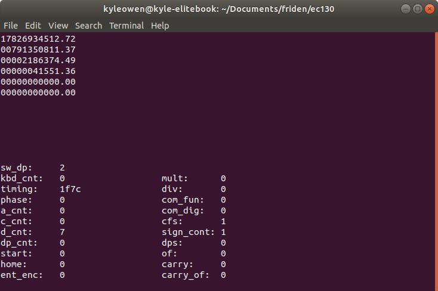
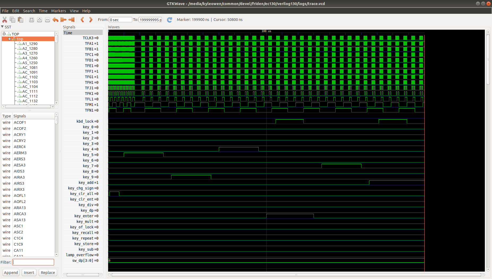

# friden
Verilog models of Friden calculators, simulated using Verilator

## Updates:
6 July 2022: EC-132 and EC-130 (4 counter) models are tested and operational
30 June 2022: EC-130 (3 counter) model is tested and operational

## Dependencies:  
 - verilator  
 - ncurses-dev  

## Screenshots:  

