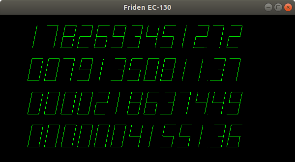

# friden
Verilog models of Friden calculators, simulated using Verilator

## Updates:
 - 8 July 2022: Added an EC-130 simulator with OpenGL support
 - 6 July 2022: EC-132 and EC-130 (4 counter) models are tested and operational
 - 30 June 2022: EC-130 (3 counter) model is tested and operational

## Dependencies:  
 - verilator  
 - ncurses-dev (for terminal-based simulator)  
 - freeglut3-dev (for OpenGL-based simulator)  

## Screenshots:  

